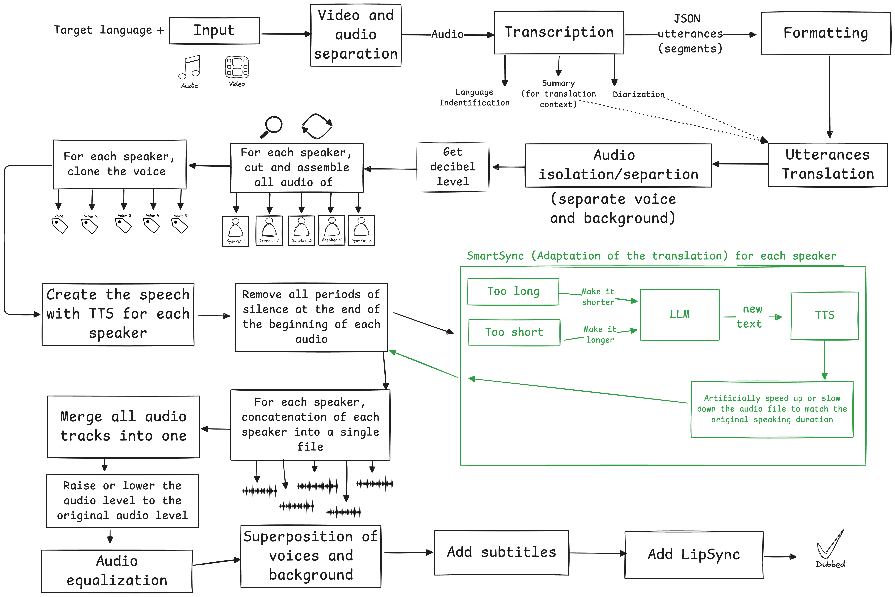

# Dubbing Engine with Bun and Typescript

[](https://github.com/kevinrss01/dubbing-engine)

## 🌐 Demo

### Original video

https://github.com/user-attachments/assets/73a22695-9457-4c10-8782-c663dae249f3

### Translated video

https://github.com/user-attachments/assets/a7b07820-a99c-4c95-80f6-e2c76f8d191b

This AI-powered translation and video dubbing engine can translate audio and video files while cloning the original voices, adding subtitles, and synchronizing lip movements. The engine powers [VoiceCheap.ai](https://voicecheap.ai).

## ✨ Features

- Voice cloning & generation
- Automatic language detection
- Speech adaptation for natural timing (SmartSync)
- Background audio separation
- Subtitle generation
- Lip synchronization
- Supports 35 languages

## 🧠 How It Works

The dubbing process follows these steps:

1. **Configuration**: Select target language and options
2. **Transcription & Analysis**:
   - Identify source language
   - Transcribe audio
   - Generate context summary
   - Perform speaker diarization (identify different speakers)
3. **Translation**:
   - Format speech segments
   - Translate with LLM contextual awareness
4. **Audio Processing**:
   - Separate voices and background audio
   - Measure audio levels
   - Create timeline for each speaker
5. **Voice Generation**:
   - Clone each speaker's voice
   - Apply SmartSync adaptation to match timing
   - Adjust speed if necessary
6. **Final Assembly**:
   - Concatenate translated segments
   - Adjust audio levels and equalize
   - Merge translated voices with background audio
   - Add subtitles
   - Apply lip synchronization

### SmartSync Adaptation

SmartSync adapts the speaker's speech based on language and speaking speed to match the original timing as closely as possible. When a literal translation would run too long, it intelligently reformulates sentences to maintain natural pacing and synchronization with the original speech.

## 🚀 Getting Started

### Prerequisites

Before launching the project, make sure you have the following software installed:

- **Node.js**: [Download Node.js](https://nodejs.org/)
- **Bun**: JavaScript runtime & toolkit
- **FFmpeg**: Audio/video processing tool
- **API Keys**: For various services (see below)

#### How to Install Required Software

**Node.js**

- **Windows / macOS / Linux**: Download and install from [https://nodejs.org/](https://nodejs.org/)

**Bun**

- **macOS / Linux / Windows (WSL)**:
  ```bash
  curl -fsSL https://bun.sh/install | bash
  ```
  For more details, see [Bun's official install guide](https://bun.sh/docs/installation).

**FFmpeg**

- **macOS**: Install via Homebrew:
  ```bash
  brew install ffmpeg
  ```
- **Windows**: Download the latest build from [https://ffmpeg.org/download.html](https://ffmpeg.org/download.html), extract, and add the `bin` folder to your PATH.
- **Linux**: Install via package manager (e.g. Ubuntu/Debian):
  ```bash
  sudo apt update && sudo apt install ffmpeg
  ```
  For other distributions, see [FFmpeg's official download page](https://ffmpeg.org/download.html).

#### API Keys Required

You will need API keys from the following services:

- **OpenAI**: [Get your API key here](https://platform.openai.com/account/api-keys)
- **Gladia**: [Sign up and get your API key here](https://app.gladia.io/)
- **Eleven Labs**: [Sign up and get your API key here](https://elevenlabs.io/)
- **Lalal.ai**: [Sign up and get your license key here](https://www.lalal.ai/)
- **SyncLab**: [Sign up and get your API key here](https://synclab.ai/)
  - **Note**: SyncLab requires a subscription. To add lipsync to videos longer than 5 minutes, you must have a "Scale" plan.
- **AWS (for lipsync)**: Create an account at [AWS](https://aws.amazon.com/) and generate S3 credentials if you want to use the lipsync feature.

Create a `.env` file based on the `.env.example` and fill in your API keys:

```
PORT=4000
OPENAI_API_KEY=your_openai_api_key_here
GLADIA_API_KEY=your_gladia_api_key_here
ELEVEN_LABS_API_KEY=your_eleven_labs_api_key_here
LALAL_LICENSE_KEY=your_lalal_license_key_here
SYNC_LAB_API_KEY=your_sync_lab_api_key_here

#AWS (For lipsync)
AWS_S3_REGION=your_aws_s3_region_here
AWS_ACCESS_KEY_ID=your_aws_access_key_id_here
AWS_SECRET_ACCESS_KEY=your_aws_secret_access_key_here
AWS_BUCKET_NAME=your_aws_bucket_name_here
```

> **Note**: AWS credentials are only required for the lipsync feature. Users need a "Scale" subscription for SyncLab to add lipsync to videos longer than 5 minutes.

> **Important**: It is mandatory to add your own API keys in the `.env` file for all services (excluding the SyncLab API key, which is optional). Without these keys, you will not be able to start the project.

### Installation & Usage

1. Clone the repository
2. Create and configure your `.env` file with the necessary API keys
3. Run the start script:

```bash
./start.sh
```

The script will:

- Check for required dependencies
- Verify environment variables
- Install necessary packages
- Guide you through the dubbing process

## 🛠️ Technology

- **TypeScript**: Core programming language
- **Bun**: JavaScript runtime and toolkit
- **OpenAI**: Translation and text adaptation
- **Gladia**: Audio transcription
- **Eleven Labs**: Voice cloning and speech generation
- **Lalal.ai**: Audio separation
- **SyncLab**: Lip synchronization

## 🔤 Supported Languages

The engine supports all these languages:

| Accepted Input Language | Output Language                            |
| ----------------------- | ------------------------------------------ |
| Afrikaans               |                                            |
| Albanian                |                                            |
| Amharic                 |                                            |
| Arabic                  | Arabic                                     |
| Armenian                |                                            |
| Azerbaijani             |                                            |
| Bashkir                 |                                            |
| Belarusian              |                                            |
| Bengali                 |                                            |
| Bosnian                 |                                            |
| Breton                  |                                            |
| Bulgarian               | Bulgarian                                  |
| Burmese                 |                                            |
| Catalan                 |                                            |
| Chinese                 | Mandarin                                   |
| Croatian                | Croatian                                   |
| Czech                   | Czech                                      |
| Danish                  | Danish                                     |
| Dutch                   | Dutch                                      |
| English                 | English, American English, British English |
| Estonian                |                                            |
| Finnish                 | Finnish                                    |
| French                  | French, French Canadian                    |
| Galician                |                                            |
| Georgian                |                                            |
| German                  | German                                     |
| Greek                   | Greek                                      |
| Gujarati                |                                            |
| Haitian                 |                                            |
| Hausa                   |                                            |
| Hebrew                  |                                            |
| Hindi                   | Hindi                                      |
| Hungarian               | Hungarian                                  |
| Icelandic               |                                            |
| Indonesian              | Indonesian                                 |
| Italian                 | Italian                                    |
| Japanese                | Japanese                                   |
| Javanese                |                                            |
| Kannada                 |                                            |
| Kazakh                  |                                            |
| Korean                  | Korean                                     |
| Lao                     |                                            |
| Latvian                 |                                            |
| Lingala                 |                                            |
| Lithuanian              |                                            |
| Luxembourgish           |                                            |
| Macedonian              |                                            |
| Malagasy                |                                            |
| Malay                   | Malay                                      |
| Malayalam               |                                            |
| Marathi                 |                                            |
| Moldavian               |                                            |
| Moldovan                |                                            |
| Mongolian               |                                            |
| Nepali                  |                                            |
| Norwegian               | Norwegian                                  |
| Occitan                 |                                            |
| Panjabi                 |                                            |
| Pashto                  |                                            |
| Persian                 |                                            |
| Polish                  | Polish                                     |
| Portuguese              | Portuguese                                 |
| Pushto                  |                                            |
| Romanian                | Romanian                                   |
| Russian                 | Russian                                    |
| Serbian                 |                                            |
| Sindhi                  |                                            |
| Sinhala                 |                                            |
| Slovak                  | Slovak                                     |
| Slovenian               |                                            |
| Somali                  |                                            |
| Spanish                 | Spanish                                    |
| Sundanese               |                                            |
| Swahili                 |                                            |
| Swedish                 | Swedish                                    |
| Tagalog                 | Tagalog                                    |
| Tamil                   | Tamil                                      |
| Turkish                 | Turkish                                    |
| Ukrainian               | Ukrainian                                  |
| Urdu                    |                                            |
| Uzbek                   |                                            |
| Valencian               |                                            |
| Vietnamese              | Vietnamese                                 |
| Welsh                   |                                            |
| Yiddish                 |                                            |
| Yoruba                  |                                            |

## 🤝 Contributing

Contributions are welcome! Feel free to:

- Star this repository to show support
- Open issues for bugs or feature requests
- Submit pull requests to improve the codebase

## ⚠️ Requirements

For optimal performance and to use all features:

- Ensure FFmpeg is properly installed
- Configure all API keys
- For lipsync features, AWS S3 credentials are required
- SyncLab "Scale" subscription for longer videos

## 📄 License

N/A

## 📊 Translation Quality & Model Options

The quality of translations can be increased depending on your needs and budget by changing the AI models used:

- **Translation Models**: You can use instead, reasoning models like o3-mini (with reasoning capabilities), or upcoming models like o4-mini or o4.
- **Adaptation Quality**: For models supporting reasoning efforts (o1, o3-mini, o3, o1-Pro), you can increase the reasoning_effort parameter from 'medium' to "high".

These options allow you to balance cost versus quality based on your specific requirements.

## 🏆 Smarter Models

You can leverage models with superior performance on the [MMLU-Pro benchmark](https://huggingface.co/spaces/TIGER-Lab/MMLU-Pro) for enhanced translation quality. Avoid using DeepL as it lacks comprehensive context handling and instruction adherence.

## 🔧 Alternative Open-Source Models

To reduce external API dependencies, consider using open-source alternatives:

- **Transcription**: Whisper
- **Text-to-Speech**: `hexgrad/Kokoro-82M`, Orpheus Speech from Canopy, SESAME models
- **Translation & Adaptation**: LLAMA
- **Multi-language Voice Cloning**: _TBD_
- **Lip Synchronization**: Wav2Lip

---

If you find this project helpful, please consider giving it a ⭐ to show support!
